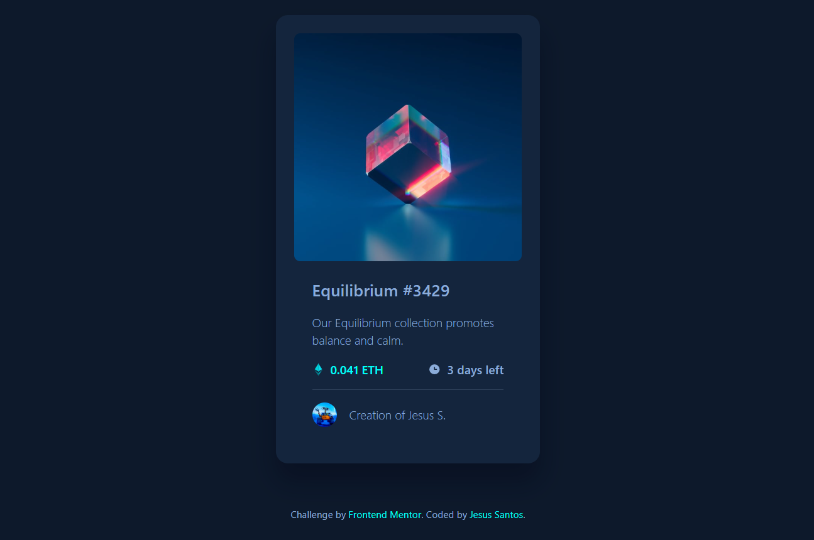

# Frontend Mentor - NFT Preview Card Component Solution

This is a solution to the [NFT preview card component challenge on Frontend Mentor](https://www.frontendmentor.io/challenges/nft-preview-card-component-SbdUL_w0U).

## Table of contents

- [Overview](#overview)
  - [The challenge](#the-challenge)
  - [Screenshot](#screenshot)
  - [Links](#links)
- [My process](#my-process)
  - [Built with](#built-with)
  - [What I learned](#what-i-learned)
  - [Continued development](#continued-development)
  - [Useful resources](#useful-resources)
- [Author](#author)

## Overview

### The challenge

Users should be able to:

- View the optimal layout for the component depending on their device's screen size.
- See hover states for all interactive elements (title, creator, and the main image).

### Screenshot

### Links

- **Repository URL:** [Paste your GitHub URL here]
- **Live Site URL:** [Paste your GitHub Pages URL here]

## My process

### Built with

- **Semantic Markup:** Used `<main>` and `<footer>` tags for accessibility (Landmarks).
- **CSS Custom Properties (Variables):** To manage the dark color scheme.
- **Flexbox:** For perfect vertical and horizontal card centering, and metadata alignment.
- **Units:** Used **`rem`** for layout scalability.
- **Accessibility (A11y):** Implemented `aria-label` on the image link and `:focus` states.

### What I learned

My biggest takeaway from this project was the importance of **CSS debugging** and strict precision with CSS units.

1.  **The Units Bug (`max-width`):** The most critical lesson was fixing the typo `max-width: 350rem;`. This impossible value caused my card to expand thousands of pixels wide, breaking the centering. This taught me not to confuse **`rem`** with **`px`** and to carefully inspect CSS unit values.
2.  **Complex Interaction Implementation:** I mastered implementing multiple independent **`:hover` states** (title, creator name, and the image overlay), ensuring they all changed to the accent color (`--accent`) simultaneously.
3.  **Content and Accessibility:** I reinforced that HTML must contain **all** visible content. The Eye Icon (`<svg>`) failed to appear because it had been accidentally deleted from the structure, highlighting the need to maintain all necessary content.
4.  **Semantics:** I successfully implemented **`<main>` and `<footer>`** to eliminate the Accessibility **Landmark** warnings.

### Continued development

I want to continue focusing on:

1.  **Layout Deep Dive:** Exploring **CSS Grid** for more complex designs that require two-dimensional structures.
2.  **JavaScript:** Beginning to use JavaScript to add interactivity and logic to my projects.
3.  **Proactive Accessibility:** Continuing to implement accessibility best practices (like `prefers-reduced-motion`) as a default configuration in all my new projects.

### Useful resources

- [MDN Web Docs - Flexbox] (https://developer.mozilla.org/es/docs/Web/CSS/CSS_Flexible_Box_Layout/Basic_Concepts)
- [Browser Inspection Tools] (For debugging errors like the `max-width` unit issue).

## Author

- **Frontend Mentor** - [@jesussantos210](https://www.frontendmentor.io/profile/jesussantos210)
